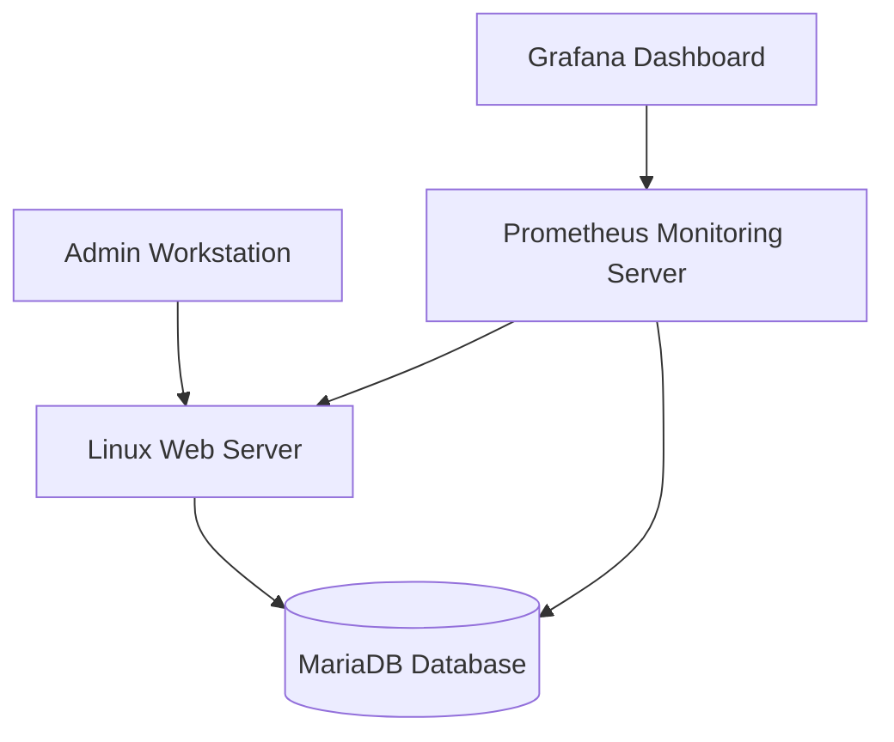

# Local AI Workstation on Ubuntu — LM Studio, AppImage Troubleshooting & Local LLM Execution

## Résumé exécutif — Français

Ce lab documente l'installation et la validation de **LM Studio sur Ubuntu Linux** afin de mettre en place une station de travail locale dédiée à l'exécution de modèles LLM.

L'objectif principal était de disposer d'un environnement IA local, utile pour l'assistance technique, la documentation, les scripts Linux, la cybersécurité, l'analyse d'erreurs et les missions nécessitant davantage de confidentialité.

Le lab inclut également la résolution d'un incident réel lié au **sandbox Electron/Chromium** lors de l'exécution de LM Studio au format **AppImage**, ainsi que la validation fonctionnelle du modèle `google/gemma-4-e4b`.

---

## 1. Project Overview

This lab documents the setup of a local AI workstation on **Ubuntu Linux** using **LM Studio**.

The goal was to deploy and validate a local LLM environment that can support technical work such as:

- Linux administration assistance
- Cloud and infrastructure documentation
- Security-oriented troubleshooting
- Script generation
- Technical research
- Local AI experimentation
- Offline or privacy-conscious workflows
- AI-assisted technical documentation

This lab is part of a broader learning path toward a **Cloud & Infrastructure Security Architect** profile, with a focus on Linux, security, cloud platforms, automation, monitoring and local AI tooling.

---

## 2. Why This Lab Matters

Running LLMs locally is becoming increasingly useful for infrastructure, cloud and security engineers.

A local AI workstation can help with:

- Generating Linux commands and scripts
- Drafting technical documentation
- Explaining logs and errors
- Preparing incident reports
- Creating architecture diagrams in Mermaid or PlantUML
- Working with sensitive data without immediately sending it to external cloud services
- Increasing productivity during troubleshooting and infrastructure design tasks

This lab demonstrates not only installation skills, but also practical troubleshooting, validation and technical documentation.

---

## 3. Lab Objectives

The objectives of this lab were to:

1. Install LM Studio on Ubuntu Linux.
2. Run an AppImage-based application from the terminal.
3. Diagnose an Electron/Chromium sandbox error.
4. Apply a working workaround using the `--no-sandbox` option.
5. Create a desktop launcher for LM Studio.
6. Validate local LLM execution.
7. Test the `google/gemma-4-e4b` model.
8. Understand the difference between text-based LLMs, multimodal models and image generation models.
9. Document the complete process in a professional GitHub-ready format.

---

## 4. Environment

| Component | Details |
|---|---|
| Host OS | Ubuntu Desktop |
| User | `archer` |
| Application | LM Studio |
| Package format | AppImage |
| Install directory | `~/Applications/LMStudio` |
| AppImage file | `LM-Studio-0.4.16-2-x64.AppImage` |
| Tested model | `google/gemma-4-e4b` |
| Main use case | Local AI workstation for Linux, cloud and security workflows |

---

## 5. Installation Steps

### 5.1 Create the installation directory

```bash
mkdir -p ~/Applications/LMStudio
cd ~/Applications/LMStudio
```

### 5.2 Make the AppImage executable

```bash
chmod +x LM-Studio-0.4.16-2-x64.AppImage
```

### 5.3 First execution attempt

```bash
./LM-Studio-0.4.16-2-x64.AppImage
```

The first execution attempt failed with an Electron/Chromium sandbox-related error.

---

## 6. Incident: Electron / Chromium Sandbox Error

### 6.1 Error Message

```text
FATAL:sandbox/linux/suid/client/setuid_sandbox_host.cc:166
The SUID sandbox helper binary was found, but is not configured correctly.
Rather than run without sandboxing I'm aborting now.
You need to make sure that /tmp/.mount_LM-Stu.../chrome-sandbox is owned by root and has mode 4755.

Trace/breakpoint trap (core dumped)
```

### 6.2 Root Cause Analysis

The issue was not caused by a corrupted LM Studio installation.

The error was related to the way some **Electron/Chromium-based applications** behave when packaged as **AppImage** files on Linux.

When an AppImage runs, it is temporarily mounted under a path similar to:

```text
/tmp/.mount_...
```

The embedded `chrome-sandbox` binary expects specific ownership and permissions:

```text
Owner: root
Mode: 4755
```

Because the AppImage is mounted dynamically in a temporary location, the sandbox requirements may not be satisfied, causing the application to abort.

---

## 7. Resolution

### 7.1 Workaround Used

LM Studio was successfully launched using the `--no-sandbox` option:

```bash
cd ~/Applications/LMStudio
./LM-Studio-0.4.16-2-x64.AppImage --no-sandbox
```

### 7.2 Result

After applying this option, LM Studio launched successfully.

This confirmed that:

- The AppImage file was valid.
- The executable permission was correctly applied.
- The issue was related to the Electron/Chromium sandbox.
- LM Studio could run properly on the Ubuntu workstation.

---

## 8. Desktop Launcher Integration

To make LM Studio easier to launch from the Ubuntu application menu, a desktop entry was created.

### 8.1 Create the desktop entry

```bash
mkdir -p ~/.local/share/applications
nano ~/.local/share/applications/lmstudio.desktop
```

### 8.2 Desktop entry content

```ini
[Desktop Entry]
Name=LM Studio
Comment=Run local LLM models
Exec=/home/archer/Applications/LMStudio/LM-Studio-0.4.16-2-x64.AppImage --no-sandbox
Icon=utilities-terminal
Terminal=false
Type=Application
Categories=Development;AI;
```

### 8.3 Enable the launcher

```bash
chmod +x ~/.local/share/applications/lmstudio.desktop
update-desktop-database ~/.local/share/applications 2>/dev/null
```

### 8.4 Validation

LM Studio was then available from the Ubuntu application menu.

---

## 9. Functional Validation

| Validation Test | Result |
|---|---|
| AppImage execution permission | Successful |
| First launch attempt | Failed due to sandbox issue |
| Error analysis | Completed |
| Launch with `--no-sandbox` | Successful |
| Desktop launcher creation | Successful |
| LM Studio GUI startup | Successful |
| Local model loading | Successful |
| Model interaction | Successful |

---

## 10. Model Tested: `google/gemma-4-e4b`

After LM Studio was successfully installed and launched, the model `google/gemma-4-e4b` was tested.

The model worked properly for text-oriented tasks such as:

- Answering technical questions
- Explaining Linux concepts
- Helping with documentation
- Generating command examples
- Assisting with troubleshooting
- Producing structured technical content
- Supporting lab documentation

However, an important limitation was identified.

The model does not directly generate graphical images or visual assets.

---

## 11. Understanding Model Capabilities

The tested model is suitable for text-based and reasoning tasks.

It can help generate:

- Markdown documentation
- Linux commands
- Bash scripts
- Architecture descriptions
- Mermaid diagrams
- PlantUML diagrams
- Technical explanations
- Troubleshooting procedures

It is not designed to generate real images.

For image generation, specialized tools are more appropriate, such as:

- Stable Diffusion
- ComfyUI
- SDXL
- FLUX
- Stable Diffusion WebUI Forge

For technical diagrams, the recommended approach is to use text-based diagram tools such as:

- Mermaid
- PlantUML
- Graphviz
- Draw.io
- Excalidraw

---

## 12. Example: Mermaid Diagram Generation

A local LLM can still help generate architecture diagrams by producing Mermaid code.

Example prompt:

```text
Generate a Mermaid diagram for a secure Linux monitoring architecture with an admin workstation, a web server, a database server, Prometheus and Grafana.
```

Example output:



This type of output can be included directly in GitHub documentation.

---

## 13. Skills Demonstrated

### Linux Administration

- Managing executable files
- Running AppImage applications
- Working from the command line
- Organizing local application directories
- Creating user-level desktop launchers

### Troubleshooting

- Reading and interpreting technical error messages
- Identifying application startup failures
- Understanding the difference between permission issues and runtime sandbox issues
- Applying a targeted workaround
- Validating the correction

### AppImage and Electron Understanding

- Understanding AppImage execution behavior
- Identifying Electron/Chromium sandbox issues
- Recognizing temporary mount paths under `/tmp`
- Using launch flags to bypass runtime blocking issues when required

### Local AI Workstation Setup

- Deploying a local LLM environment
- Loading and testing a model in LM Studio
- Understanding model capabilities and limitations
- Positioning local AI as a technical productivity tool

### Technical Documentation

- Documenting an installation process
- Recording a real incident and its resolution
- Writing a clean GitHub-ready lab report
- Producing reusable technical documentation

---

## 14. Troubleshooting Summary

| Issue | Root Cause | Resolution |
|---|---|---|
| LM Studio did not start | Electron/Chromium sandbox issue | Used `--no-sandbox` |
| `chrome-sandbox` permission error | AppImage temporary mount did not satisfy sandbox requirements | Launched the AppImage with an adapted runtime flag |
| Model did not generate images | The selected model is not an image generation model | Use Mermaid for diagrams or Stable Diffusion/ComfyUI for image generation |

---

## 15. Security Note

The `--no-sandbox` option was used as a practical workaround to validate the installation and execution of LM Studio.

For a production-grade workstation, it would be better to investigate a more secure long-term approach, such as:

- Using an official package format if available
- Applying an AppArmor profile when appropriate
- Keeping LM Studio updated
- Downloading software only from trusted sources
- Avoiding the use of untrusted AppImage files

This distinction is important: the workaround solved the execution issue, but security implications should always be considered when disabling sandbox mechanisms.

---

## 16. Cleanup

To remove the manually installed LM Studio AppImage and desktop launcher:

```bash
rm -rf ~/Applications/LMStudio
rm -f ~/.local/share/applications/lmstudio.desktop
update-desktop-database ~/.local/share/applications 2>/dev/null
```

---

## 17. Consultant Deliverables

This lab can produce the following deliverables in a professional context:

- Local AI workstation installation report
- Troubleshooting note for Electron/AppImage sandbox errors
- Desktop integration procedure
- Model capability assessment
- Security note about sandbox bypass usage
- Recommendations for local AI tooling in Linux and security workflows

---

## 18. Conclusion

This lab demonstrates the deployment of a local AI workstation on Ubuntu using LM Studio.

The main value of the lab is not limited to the installation itself. It also demonstrates the ability to:

- Troubleshoot a real Linux application startup issue
- Understand AppImage and Electron runtime behavior
- Apply a practical workaround
- Validate local LLM execution
- Identify model limitations
- Document the process in a professional format

This workstation can now serve as a foundation for more advanced labs involving:

- Local LLM usage for Linux administration
- Secure private AI environments
- AI-assisted documentation
- Infrastructure automation
- Cybersecurity workflows
- Cloud and Linux engineering productivity

This lab supports a broader progression toward a **Cloud & Infrastructure Security Architect** role, combining Linux administration, troubleshooting, documentation, security awareness and practical AI tooling.
